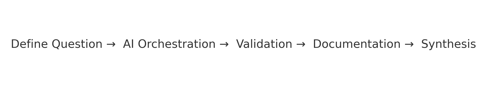

# AI Orchestration Method (AOM)

  
  
  

---

  

---

## What This Is

AI is moving fast, but most teams don’t have reproducible workflows.  
The **AI Orchestration Method (AOM)** makes AI projects **transparent, auditable, and transferable** by combining structured human oversight with reproducible documentation.  

AOM is not a coding framework — it’s a **research and process framework**. Its goal is to turn AI-assisted work into something that can be trusted, traced, and reused across domains.  

---

## Why It Matters

AI is now embedded in the workflow itself. That creates challenges:  

- How do we validate outputs without blind trust?  
- How do we reproduce results across people and projects?  
- How do we balance speed with rigor?  

**AOM answers these problems** by turning ad-hoc AI use into a structured, repeatable orchestration method.  

---

## Core Principles

- **Falsifiability First** → methods must be disprovable, not just impressive  
- **AI as Partner** → models are collaborators in inquiry, not black boxes  
- **Process Over Outcome** → the structure of inquiry matters as much as the result  

---

## Workflow Cycle

1. **Define Question** → Frame the inquiry clearly  
2. **AI Orchestration** → Deploy models to explore possibilities  
3. **Validation** → Stress-test outputs with data, logic, or constraints  
4. **Documentation** → Record decisions, failures, and results  
5. **Synthesis** → Distill insights and caveats into usable knowledge  

  

---

## Skills Demonstrated

- **Workflow design & process engineering** → structuring projects for clarity and repeatability  
- **Human-in-the-loop oversight** → embedding validation and falsifiability into AI use  
- **Reproducibility practices** → workflow logs, documentation templates, and audit trails  
- **Applied analysis** → translating orchestration methods into science, business, and social domains  
- **Method development** → creating frameworks for scaling AI–human collaboration  

---

## Deliverables

- **Workflow Logs** → chronological records of project decisions  
- **Documentation Templates** → reusable structures for validation  
- **Case Studies** → applied demonstrations of AOM in practice  

An applied demonstration (customer review analysis) is under development and will be linked here once published.  

---

## Roles

- **Orchestrator (Human):** Guides direction, applies falsifiability, validates outputs  
- **AI Models:** Generate alternatives, surface blind spots, accelerate iteration  
- **Orchestration Layer:** Captures logs, integrates outputs, ensures reproducibility  

---

## Logs

Logs are stored in the [`logs/`](logs) directory.  
Each file is timestamped for clarity and archival purposes.  

Logs demonstrate how AOM tracks **decisions, alternatives, and validations** across the project lifecycle.  

---

## Author

**Shawn C. Wright**  
Researcher developing reproducible workflows for AI–human collaboration.  
Focused on orchestration methods, documentation, and applied analysis across science and business domains.  

- ORCID: [0009-0006-6043-9295](https://orcid.org/0009-0006-6043-9295)  
- Email: **shawnkardin [at] gmail [dot] com**  
- GitHub: [Wright-Shawn](https://github.com/Wright-Shawn)  

---

## License

This repository uses a dual license:

- **Apache 2.0** → applies to source code, scripts, and automation  
- **CC BY 4.0** → applies to documentation, prose, logs, and workflow notes  

By using this repository, you agree to comply with both.  

See:  
- [LICENSE](LICENSE) (Apache 2.0)  
- [LICENSE-CC-BY-4.0.md](LICENSE-CC-BY-4.0.md) (Creative Commons Attribution 4.0)  