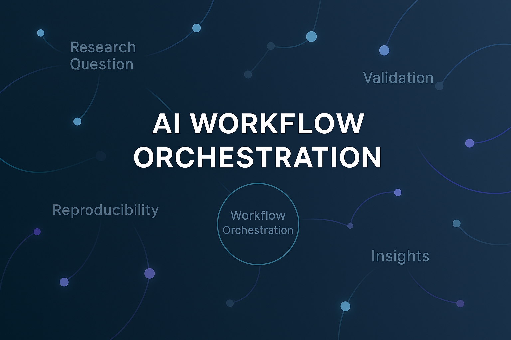

# AI Orchestration Method (AOM)

[](LICENSE)  
[](LICENSE-CC-BY-4.0.md)  
[](https://orcid.org/0009-0006-6043-9295)  
[](CITATION.cff)  

---

<p align="center">
  
</p>

---

## What This Is (Plain Language)

The **AI Orchestration Method (AOM)** is a framework for structuring, critiquing, and validating AI-assisted work.  

It provides reproducible workflow logs, documentation practices, and case studies. The goal is to make **AI–human collaboration** transparent, trustworthy, and scalable — bridging the gap between *automation* and *explanation* in both research and applied problem solving.

---

## Why It Matters

AI is no longer just a tool — it’s part of the workflow itself. That creates new challenges:  

- How do we validate outputs without blind trust in AI?  
- What standards make AI-assisted work reproducible across teams?  
- How do we formalize **human-in-the-loop oversight**?  
- How do we scale workflows from research questions to applied business domains?  

**AOM is the answer.** It turns abstract challenges of AI epistemology into a **concrete orchestration framework** for real projects.

---

## Skills Demonstrated

- **Workflow design & quality gates** – ensuring clarity and reproducibility at every step.  
- **Methodology development** – formalizing a domain-agnostic orchestration process.  
- **Human-in-the-loop oversight** – integrating validation and falsifiability checks.  
- **Research reproducibility** – workflow logs, documentation templates, and case studies.  
- **Applied analysis** – demonstrations on scientific and business problems.  

---

## Deliverables

- **Workflow logs** – chronological records of project evolution.  
- **Documentation templates** – reproducible structures for validation.  
- **Case studies** – applied demonstrations of AOM in action.  
- **Theory notes** – methodological rationale and principles.  

---

## Core Workflow Cycle

1. **Define Research Question** → Frame the inquiry clearly.  
2. **AI Orchestration** → Deploy multiple AI models/agents to explore possible answers.  
3. **Validation & Falsification** → Compare outputs against data, logic, or constraints.  
4. **Documentation & Reproducibility** → Record decisions, failures, and results.  
5. **Synthesis & Insights** → Distill findings into knowledge claims and caveats.  

---

## Roles in the Workflow

- **Human (Orchestrator):** defines the problem, interprets AI outputs, and applies falsifiability standards.  
- **AI Models:** generate hypotheses, run simulations, provide alternative formulations.  
- **Orchestration Layer:** integrates outputs, ensures consistency, reproducibility, and logging.  

---

## Repository Structure

```
theory/          # Core methodological notes & rationale
methods/         # Templates, workflow logs, reproducibility practices
case_studies/    # Links & summaries of applied demonstrations
docs/            # Extended methodology guide
figures/         # Workflow diagrams & process charts
citations/       # References & external sources
WORKFLOW_LOG.md  # Factual timeline of project development
DIALOGUE_LOG.md  # Curated transcript showing project emergence
```

---

## Case Studies

The following projects demonstrate AOM in action:  

- [Waveframe Cosmology](link) → AOM applied to theoretical physics.  
- [Customer Review Analysis](link) → AOM applied to business insights.  
- [Societal Progress Simulator](link) → AOM applied to social dynamics.  

---

## Principles

- **Falsifiability First** – models are judged by how they can fail, not just succeed.  
- **AI as Partner** – AI outputs are collaborators in inquiry, not black boxes.  
- **Process Over Outcome** – the structure of inquiry is as important as the result.  

---

## Project Logs  

All dialogue and workflow records are stored in the [`logs/`](logs) directory.  
Each log file is timestamped for clarity and archival purposes.  

- **Workflow Logs** → Factual timelines of project development.  
- **Dialogue Logs** → Curated excerpts showing the emergence of ideas.  

Example:  
- [WORKFLOW_LOG_2025-08-21.md](logs/WORKFLOW_LOG_2025-08-21.md)  
- [DIALOGUE_LOG_2025-08-21.md](logs/DIALOGUE_LOG_2025-08-21.md)  

---

## Author  

**Shawn C. Wright**  
Independent AI-assisted researcher  

- ORCID: [0009-0006-6043-9295](https://orcid.org/0009-0006-6043-9295)  
- Email: **shawnkardin@gmail.com**  
- GitHub: [shawncwright](https://github.com/Wright-Shawn)  

I develop and document structured workflows for AI-assisted research and applied analysis, with the **AI Orchestration Method (AOM)** as the flagship framework. My work spans both theoretical modeling (e.g., cosmology through Waveframe) and practical applications (e.g., customer review analysis).  

---

## Citation

If you use or reference this work, please cite via the [CITATION.cff](CITATION.cff) file or ORCID:  

**ORCID:** [0009-0006-6043-9295](https://orcid.org/0009-0006-6043-9295)  

---

## License  

This repository is dual-licensed to maximize both open knowledge sharing and structured attribution:  

- **Apache 2.0 License** → Permissive use for code and workflows.  
- **Creative Commons CC BY 4.0 License** → Attribution required for textual content and documentation.  

By using this repository, you agree to comply with the terms of both licenses.  

See:  
- [LICENSE](LICENSE) (Apache 2.0)  
- [LICENSE-CC-BY-4.0.md](LICENSE-CC-BY-4.0.md) (Creative Commons Attribution 4.0)  
