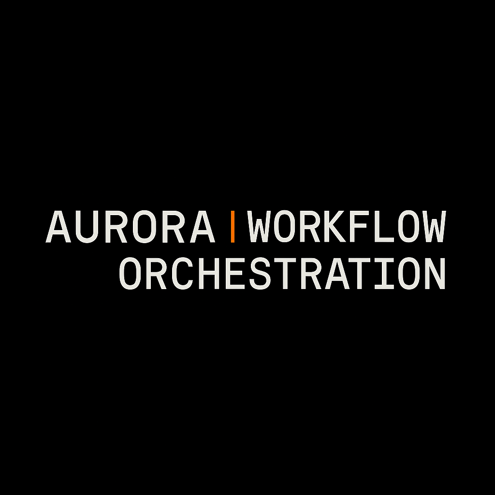

# Aurora Workflow Orchestration (AWO)

[](https://doi.org/10.5281/zenodo.17013612)  
[](LICENSE)  
[](LICENSE-CC-BY-4.0.md)  
[](CITATION.cff)  


_Code under Apache 2.0 · Documentation under CC BY 4.0_



> **Aurora Workflow Orchestration (AWO)**  
> A formal method for reproducible AI-assisted research  
> • Falsifiability • Provenance • Attestation • Auditability  
> • Works manually or via **CRI-CORE** automation  
> • Every artifact is signed, structured, and verifiable

AWO is a reproducibility framework for AI-assisted research — turning every run into a verifiable scientific artifact.

---

## Overview

**Aurora Workflow Orchestration (AWO)** defines how AI-assisted research can be made reproducible and auditable.  
It translates reasoning steps, decisions, and evidence into structured files that anyone can verify.

AWO is the **methodology layer** — it governs how reproducibility works.  
**CRI-CORE** is the **execution layer** — it automates that governance.  
Together they form a single, evidence-based research system.

```
Idea → Manifest → Run → Audit → Attestation → Archive  
    |________ Governance Rules (AWO) ________|
                         ↓
             |_____ Enforcement (CRI-CORE) ____|
```

---

## Repository Structure

This repository contains the complete AWO governance layer — the foundation for reproducible, falsifiable AI research.

<details>
<summary><strong>Core Documents</strong></summary>

- [AWO Whitepaper v1.2.1](docs/AWO_Whitepaper_v1.2.1.md) ([PDF](docs/AWO_Whitepaper_v1.2.1.pdf)) — Rationale and design philosophy  
- [AWO Method Spec v1.2.1](docs/AWO_Method_Spec_v1.2.1.md) ([PDF](docs/AWO_Method_Spec_v1.2.1.pdf)) — Normative rules for compliance  
- [AWO Adoption Guide](docs/AWO_Adoption_Guide.md) ([PDF](docs/AWO_Adoption_Guide.pdf)) — Step-by-step onboarding  

</details>

<details>
<summary><strong>Governance & Evidence</strong></summary>

- [`GOVERNANCE_SUMMARY.md`](docs/GOVERNANCE_SUMMARY.md) — Compliance and attestation records  
- [`ROLE_ATTESTATION.md`](docs/ROLE_ATTESTATION.md) — Role-level verification summary  
- [`AWO_Compliance_Report.md`](docs/AWO_Compliance_Report.md) — Signed compliance certification  

</details>

<details>
<summary><strong>Design & Provenance</strong></summary>

- Architecture Decision Records (`/decisions/ADR-0001` → `ADR-0018`)  
- Validation Schemas (`/schemas/`) and Templates (`/templates/`)  
- Reproducible Runs (`/runs/`) with frozen manifests and signed approvals  

</details>

All content is cryptographically verified through [`SHA256SUMS.txt`](./SHA256SUMS.txt)  
and governed by **ADR-0015 → ADR-0018** under the Aurora Research Initiative.

---

## Why AWO Exists

AI now generates discoveries faster than science can verify them.  
The result is insight without integrity.  

**AWO is the countermeasure** — a governance layer that forces every idea to prove itself before it earns the name “knowledge.”

**Core Principles**

1. **Falsifiability First** – every claim must define how it can fail.  
2. **Human-in-the-Loop Rigor** – AI output remains a hypothesis until verified.  
3. **Immutable Provenance** – every artifact is signed, hashed, and auditable.  
4. **Transparent Governance** – reproducibility replaces reputation.

AWO turns the scientific method into a living protocol for evidence.

---

## Quick Start

You don’t need special tools or a PhD in YAML to use AWO.  
If you can commit to a Git repo, you can commit to reproducibility.

1. **Clone or fork this repository**  
   ```bash
   git clone https://github.com/Waveframe-Labs/Aurora-Workflow-Orchestration.git
   cd Aurora-Workflow-Orchestration
   ```

2. **Open the Adoption Guide**  
   → [`docs/AWO_Adoption_Guide.md`](docs/AWO_Adoption_Guide.md)  
   It walks you through creating your first falsifiability manifest and recording an attested run.

3. **Inspect a verified example**  
   Browse `/runs/` to see how manifests, approvals, and logs form a complete provenance chain.

---

## Adoption Tiers

| Tier | Audience | What It Includes |
|------|-----------|------------------|
| **Minimum** | Individuals | Manual logs + falsifiability manifests |
| **Standard** | Small teams | CI pipelines + attestation workflows |
| **Full** | Institutions | Automated reproducibility via CRI-CORE |

For a preconfigured starting point, see the  
[**AWO Template Repository**](https://github.com/Waveframe-Labs/AWO-Template).

---

## Example Projects Using AWO

| Project | Domain | Mode of Use |
|----------|---------|-------------|
| [Waveframe v4.0](https://github.com/Wright-Shawn/Waveframe-v4.0-XR) | Cosmology | Manual orchestration with falsifiability logs and ADRs |
| [Societal Simulator](https://github.com/Wright-Shawn/Societal-Progress-Simulator) | Systems modeling | Demonstrates reproducibility without automation |
| [CRI-CORE](https://github.com/Waveframe-Labs/CRI-CORE) | Research runtime | Automated orchestration and provenance enforcement |

---

## Common Questions

<details>
<summary><strong>Is AWO useful if I work alone?</strong></summary>
Absolutely. AWO scales from solo projects to full institutions. If you’re a lab of one with coffee and conviction, it still works.
</details>

<details>
<summary><strong>Do I need CRI-CORE to use AWO?</strong></summary>
No. AWO is fully functional on its own. CRI-CORE just automates what you can already do manually.
</details>

<details>
<summary><strong>Does AWO replace peer review?</strong></summary>
Not at all. It strengthens it — by ensuring every claim and artifact is traceable before publication.
</details>

<details>
<summary><strong>Can I publish AWO-based research?</strong></summary>
Yes. Include the AWO concept DOI (10.5281/zenodo.17013612) in your Methods or reproducibility statement.
</details>

---

## 🙅‍♂️ What AWO Is Not

- ❌ A software package — it’s a **method** with optional automation.  
- ❌ A belief system — it’s **governance**, not gospel.  
- ❌ Dependent on institutions — reproducibility **is** the credential.  
- ❌ Too heavy for individuals — AWO scales down cleanly to one researcher.

---

<details>
<summary><strong>Version Boundary</strong></summary>

**AWO v1.2.1 (Documentation and Accessibility Update)** marks the finalization of the AWO methodology under Waveframe Labs governance.  
Future updates appear only as errata or citation additions.

**Canonical DOI:** [10.5281/zenodo.17013612](https://doi.org/10.5281/zenodo.17013612)

</details>

---

## Maintainer

**Shawn C. Wright** — Independent Researcher, Waveframe Labs  
- ORCID [0009-0006-6043-9295](https://orcid.org/0009-0006-6043-9295)  
- Email s wright@waveframelabs.org  
- GitHub [Waveframe-Labs](https://github.com/Waveframe-Labs)

---

## Citation

If you reference or build upon AWO, please cite using the **concept DOI**.

**APA**  
> Wright, S. C. (2025). *Aurora Workflow Orchestration (AWO): A formal framework for reproducible AI-assisted research.*  
> Waveframe Labs / Aurora Research Initiative. https://doi.org/10.5281/zenodo.17013612

**BibTeX**
```bibtex
@software{wright_aurora_workflow_orchestration_2025,
  author       = {Wright, Shawn C.},
  title        = {Aurora Workflow Orchestration (AWO): A formal framework for reproducible AI-assisted research},
  year         = {2025},
  version      = {1.2.1},
  institution  = {Waveframe Labs / Aurora Research Initiative},
  license      = {Apache-2.0 (code), CC BY 4.0 (docs)},
  url          = {https://github.com/Waveframe-Labs/Aurora-Workflow-Orchestration},
  doi          = {10.5281/zenodo.17013612}
}
```

---

## Licensing

- **Code** → [Apache 2.0](LICENSE)  
- **Documentation** → [CC BY 4.0](LICENSE-CC-BY-4.0.md)

---

## Repository Status

This repository is an **archival reference artifact** — stable, verifiable, and citable.  
All new runtime development continues in **CRI-CORE**, which automates AWO’s governance logic.

---

## Integrity and Verification

This repository maintains a cryptographic integrity registry (`SHA256SUMS.txt`) at the root.  
It is automatically rebuilt and committed by the **Build root SHA256SUMS** workflow.

[](https://github.com/Waveframe-Labs/Aurora-Workflow-Orchestration/actions/workflows/root-sha256sums.yml)

**Scope**  
- All core documents under `/docs/` (whitepaper, spec, guide)  
- All ADRs under `/decisions/`  
- Compliance and governance files at root  
- Current attested runs under `/runs/`

To verify locally:

```bash
sha256sum --check SHA256SUMS.txt
```

---

<p align="center">
  <sub>© 2025 Waveframe Labs · Independent Open-Science Research Entity</sub>
</p>
