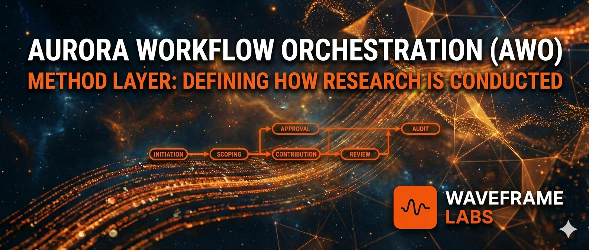

<p align="center">

  

</p>


# Aurora Workflow Orchestration (AWO)


[](https://waveframelabs.org)

[](https://github.com/Waveframe-Labs/Aurora-Research-Initiative)

[](#)

[](#)

[](https://orcid.org/0009-0006-6043-9295)

[](LICENSE)

[](https://doi.org/10.5281/zenodo.17013612)


AWO defines **how research is conducted** within Waveframe Labs’ governance stack.  

It establishes the methodological structure required for research to remain:


- reproducible  

- auditable  

- role-separated  

- artifact-first  

- falsifiable  


AWO does **not** enforce workflows or validate outputs; that authority belongs to **CRI-CORE**.


All AWO v1.x materials are preserved under `/v1-archived/`.


---


## Purpose


AWO answers a single governing question:


> **What structure must a research workflow follow so its results can be independently reconstructed and evaluated long after creation?**


To achieve that, AWO governs:


- workflow phase ordering  

- required artifacts at each phase  

- role separation and authority boundaries  

- traceability and provenance expectations  

- the machine-readable contract surface used by CRI-CORE  


It does **not** determine correctness, enforce execution, or prescribe scientific conclusions.


---


## Where to Start


Readers new to AWO should review documents in this order:


1. **AWO_OVERVIEW.md** — purpose and positioning

2. **SCOPE.md** — what AWO governs and what it does not

3. **WORKFLOW_SPEC.md** — required phases & transitions

4. **ARTIFACT_CLASSES.md** — canonical artifact categories

5. **ARTIFACT_REQUIREMENTS.md** — semantic minima for each artifact

6. **INVARIANTS.md** — governing validity rules  

7. **ROLES.md** — procedural authority and separation rules  

8. **GLOSSARY.md** — controlled vocabulary

9. **PROVENANCE_MODEL.md** — traceability and chain-of-identity model

10. **contracts/** — schemas and contract mappings for machine validation


Once these are understood, a workflow can be executed either manually or by CRI-CORE.


---


## Workflow Structure


The required AWO workflow progression is:


```

Initiation → Scoping → Contribution → Review → Approval → Audit

```


Each phase:


- has defined entry/exit conditions  

- produces required artifacts  

- is bound to specific roles  

- must maintain provenance continuity  


Missing artifacts or invalid role attribution render the workflow **non-compliant**.


---


## Repository Structure


```


/

├── contracts/ # Machine-readable contract layer

│ ├── CONTRACT_INDEX.md

│ ├── ARTIFACT_SCHEMA_MAP.md

│ └── schemas/ # JSON schemas (initiation, review, execution, release, spec)

│

├── docs/ # User-facing support material

│ ├── ONBOARDING_GUIDE.md

│ ├── FAQ.md

│ └── CHANGE_LOG.md

│

├── examples/

│ └── awo.initiation.example.json

│

├── method/

│ └── PHASE_TOPOLOGY.md # Canonical structural model for workflow phases

│

├── v1-archived/ # Deprecated AWO v1.x documents

│

├── ARTIFACT_CLASSES.md

├── ARTIFACT_REQUIREMENTS.md

├── DESIGN_ENVELOPE.md

├── GLOSSARY.md

├── INVARIANTS.md

├── NEUROTRANSPARENCY.md

├── OVERVIEW.md

├── PROVENANCE_MODEL.md

├── ROLES.md

├── SCOPE.md

├── SECURITY.md

├── LICENSE

└── awo.manifest.json

```


---


## Relationship to Other Layers


| Layer | Component | Responsibility |

|------|-----------|----------------|

| 0 | NTD / NTS | Epistemic disclosure & attribution law |

| 1 | ARI | Governance, metadata, authority, invariants |

| 2 | **AWO (this repo)** | **Methodology specification** |

| 3 | CRI-CORE | Validation, attestation, enforcement |

| 4 | Case Studies | Application of workflows (e.g., Waveframe v4.0) |


- AWO **receives governance** from ARI  

- AWO **exports contracts** to CRI-CORE  

- Tooling does not modify AWO’s meaning  


---


## Status


As of **v2.0.0**:


- Method layer is **complete**

- Contracts and schemas are **aligned**

- Example artifacts exist

- User-facing documentation is updated

- Metadata normalization pending final pass

- CHANGE_LOG will be generated before tagging the release


Integration work resumes in CRI-CORE next.


---


## Licensing & Attribution


This repository is licensed under:


**Apache License 2.0**


AI assistance is disclosed in accordance with:


- ARI Metadata Policy v2.0.0

- Neurotransparency Specification (NTS)


Derived builds (e.g., Forge PDFs) must maintain metadata equivalence.


---


<div align="center">

  <sub>© 2026 Waveframe Labs — Independent Open-Science Research Entity • Governed under ARI</sub>

</div>


status: "Active"

created: "2025-12-25"

updated: "2025-12-25"

author: "Waveframe Labs"

maintainer: "Waveframe Labs"

license: "Apache-2.0"

ai_assisted: "partial"

ai_assistance_details: "AI-assisted drafting under full human oversight."

anchors:

  - "AWO-README-v2.0.0"

---


<p align="center">

  

</p>


# Aurora Workflow Orchestration (AWO)


> Method layer of the Waveframe Labs governance stack.  

> Defines **how research is conducted**, not what conclusions are reached.


AWO provides the **normative methodological framework** for running reproducible, auditable, AI‑assisted research workflows. It formalizes workflow phases, artifact classes, invariants, contracts, and schema interfaces. AWO does **not** enforce execution — enforcement belongs to CRI‑CORE.


This repository contains the **complete AWO v2.0.0 methodology layer**, replacing all v1.x material now located in `/v1-archived/`.


---


## Purpose of AWO


AWO answers one question:


**How must research be structured so that results remain independently reconstructible, auditable, and epistemically valid?**


AWO governs:


- workflow phase ordering  

- artifact production requirements  

- role separation and authority boundaries  

- reproducibility, falsifiability, traceability  

- machine‑readable contract surface for CRI‑CORE  


AWO does **not** run workflows, validate artifacts, or adjudicate truth.


---


## Where to Start


New readers should follow documents in this order:


1. **AWO_OVERVIEW.md**

2. **SCOPE.md**

3. **WORKFLOW_SPEC.md**

4. **ARTIFACT_CLASSES.md**

5. **ARTIFACT_REQUIREMENTS.md**

6. **INVARIANTS.md** and **ROLES.md**

7. **GLOSSARY.md**, **PROVENANCE_MODEL.md**, **DESIGN_LAWS.md**

8. **contracts/** *(schemas & validation surface)*


After review, AWO should be deployable by CRI‑CORE or by human process.


---


## Method Execution Flow


```

Initiation → Scoping → Contribution → Review → Approval → Audit

```


Each phase produces **required artifacts**.  

Artifacts without metadata → **invalid**.  

Self‑attestation → **forbidden**.  

Opaque reasoning → **noncompliant**.


---


## Relation to Other Waveframe Layers


| Layer | System | Responsibility |

|---|---|---|

| 0 | NTD / NTS | Epistemic foundations & disclosure law |

| 1 | ARI | Governance, authority, metadata law |

| 2 | **AWO** | **Methodology specification (this repo)** |

| 3 | CRI‑CORE | Enforcement, attestation, validation (future) |

| 4 | Case Studies | Real‑world application of AWO workflows |


Governance sits above AWO.  

Tooling & enforcement sit below.  


---

## Citation

Please cite this specification when using AWO workflows in research.

###  Preferred Citation
```  
    Wright, Shawn C. (2026). Aurora Workflow Orchestration (AWO): Methodological Specification for AI-Assisted Research. Waveframe Labs. Version 2.0.0. https://github.com/Waveframe-Labs/Aurora-Workflow-Orchestration
```  

## BibTeX

```
@misc{wright_awo_2026,
  author       = {Wright, Shawn C. and Waveframe Labs},
  title        = {Aurora Workflow Orchestration (AWO): Methodological Specification for AI-Assisted Research},
  year         = {2026},
  version      = {2.0.0},
  publisher    = {Waveframe Labs},
  url          = {[https://github.com/Waveframe-Labs/Aurora-Workflow-Orchestration](https://github.com/Waveframe-Labs/Aurora-Workflow-Orchestration)},
  note         = {Governance Layer: Method Specification}
}
```
## Licensing & Status

**Status:** Active (v2.0.0) **License:** Apache License 2.0

This repository is document-complete. Workflows defined here are ready for integration with the CRI-CORE enforcement engine.

AI assistance is disclosed in accordance with the **ARI Metadata Policy v2.0.0.**

---


<div align="center">

  <sub>© 2025 Waveframe Labs — Independent Open‑Science Research Entity • Governed under the Aurora Research Initiative (ARI)</sub>

</div> 
