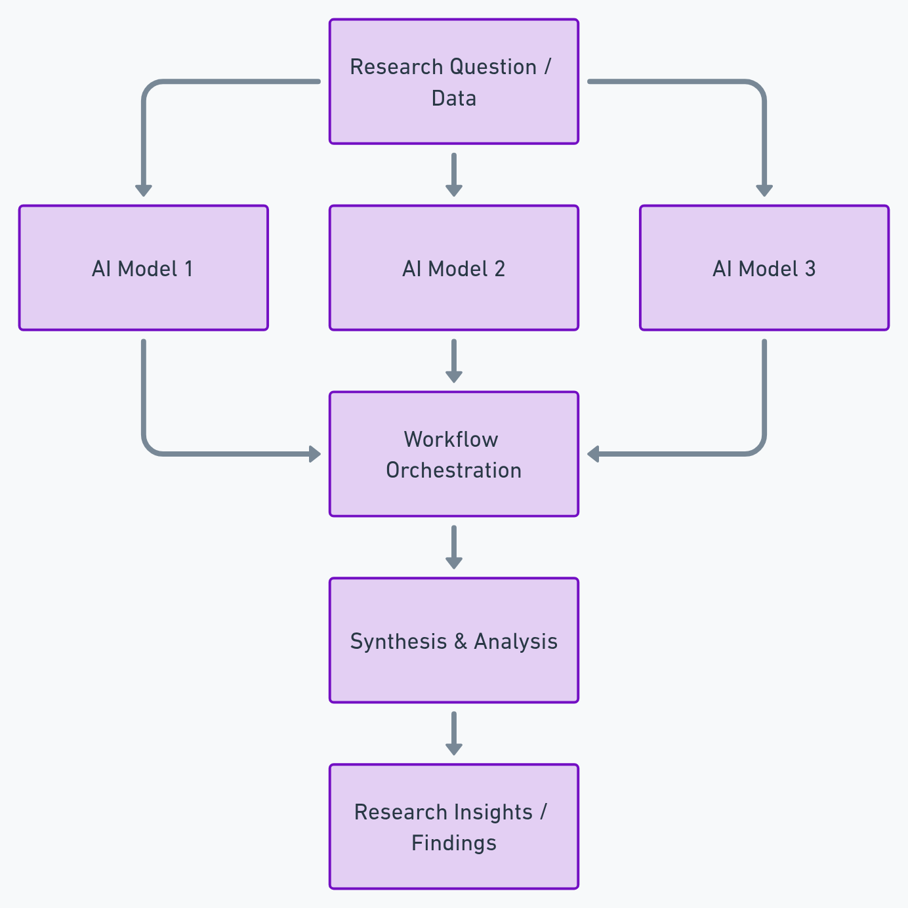

# Aurora Workflow Orchestration (AWO)

  
  
 
 

---

---

## What This Is

AI is moving fast, but most projects lack **reproducible workflows**.  
The **Aurora Workflow Orchestration (AWO)** framework makes AI projects **transparent, auditable, and transferable** by combining structured human oversight with reproducible documentation.  

AWO is not a coding library — it’s a **methodological framework**. Its goal is to turn AI-assisted work into something that can be trusted, traced, and reused across domains. 
This repository is intentionally built in public with AI assistance.  
The aim isn’t to hide AI involvement — it’s to show how AI can be audited,  
structured, and trusted in real workflows.

> **New:** AWO now integrates into a broader idea: **Continuous Research Integration (CRI)**.  
> CRI is like CI/CD for research — every run is validated, logged, and archived,  
> turning hypotheses into reproducible, continuously improving artifacts.
---

## Why It Matters

AI isn’t just a tool — it’s part of the workflow itself. That raises new challenges:  

- How do we validate outputs without blind trust?  
- How do we reproduce results across teams and contexts?  
- How do we balance speed with rigor?  

**AWO addresses these questions** by transforming ad-hoc AI use into a structured, repeatable orchestration method.  

---

## Roadmap

**This repository is alive.** AWO will continue to evolve through applied case studies and method refinements. Instead of fixed timelines, progress is tracked in phases — each tagged release reflects the latest stable state of the method.  

### Current Focus  
- **Method Whitepaper v1.0** — citable, stable reference in `docs/`.  
- **Case Study: Waveframe v4.0** — demonstration of AWO in a hard-science domain (cosmology). 

### Upcoming Priorities  
- **Societal Progress Simulator** — interactive demonstration of AWO in applied social science.  
- **Expanded case studies** — additional applications in diverse domains to stress-test and refine AWO.  
- **Refined documentation standards** — tightening how logs, artifacts, and decisions are recorded.  

### Long-Term Vision  
- **Stable release cadence** — semantic versioning with DOIs for each tagged release.  
- **Citable briefs** — lightweight, structured outputs (“minimum viable papers”) built from repo artifacts.  
- **Community use** — opening AWO for external case studies and reproducibility experiments.  

---

## In-repo Guarantees (what to expect now)

See the AWO method spec in [/docs/AWO_Method_Spec_v1.1.md](docs/AWO_Method_Spec_v1.1.md). 
Templates live in [/templates](templates), including the falsifiability manifest, dialogue logs, ADRs, and release/audit checklists.
- **Method whitepaper** in `/docs`: a citable, stable reference for AWO.  
- **Roadmap** in the README: clear direction for evolution.  
- **Citation files** (`CITATION.cff`, `citation.bib`): proper referencing support.  
- **Logs** in `/logs`: records of orchestration choices, critique loops, and design evolution.  
- **Versioning**: tagged releases, DOIs, and semantic versioning.  

> If it can’t be audited, it doesn’t count. AWO optimizes for honest, inspectable workflows over theatrics.  

---

## Core Principles

- **Falsifiability First** → outputs must be disprovable, not just impressive.  
- **AI as Partner** → models act as collaborators, not opaque black boxes.  
- **Process Over Outcome** → the rigor of inquiry matters as much as results.  

---

## Workflow Cycle

1. **Define Question** → Frame the inquiry clearly.  
2. **Orchestrate AI** → Deploy models to explore possibilities.  
3. **Validate** → Stress-test outputs with logic, data, or constraints.  
4. **Document** → Capture decisions, failures, and results.  
5. **Synthesize** → Distill findings into usable knowledge.  

  

---

## Skills Demonstrated

- **Workflow design & process engineering** → structuring projects for clarity and repeatability.  
- **Human-in-the-loop oversight** → embedding falsifiability and validation in AI use.  
- **Reproducibility practices** → logs, documentation templates, audit trails.  
- **Applied analysis** → translating orchestration into science, business, and social domains.  
- **Method development** → frameworks for scaling AI–human collaboration.  

---

## Deliverables

- **Workflow Logs** → timestamped records of project decisions.  
- **Documentation Templates** → reusable structures for reproducible inquiry.  
- **Case Studies** → applied demonstrations of AWO in practice.  

The first applied demonstration (customer review analysis) is under development and will be linked here when published.  

---

## Roles in AWO

- **Orchestrator (Human):** Frames direction, applies falsifiability, validates outputs.  
- **AI Models:** Generate alternatives, surface blind spots, accelerate iteration.  
- **Orchestration Layer:** Captures logs, integrates outputs, ensures reproducibility.  

---

## Logs

Logs are stored in the [`logs/`](logs) directory.  
Each file is timestamped for clarity and archival purposes.  

Logs demonstrate how AWO tracks **decisions, alternatives, and validations** across the project lifecycle.  

---

## Author

**Shawn C. Wright**  
Researcher developing reproducible workflows for AI–human collaboration.  
Focused on orchestration methods, documentation, and applied analysis across science and business domains.  

- ORCID:   
- Email: **shawnkardin@gmail.com**  
- GitHub: [Wright-Shawn](https://github.com/Wright-Shawn)  

---

## License

This repository uses a dual license:

- **Apache 2.0** → applies to source code, scripts, and automation.  
- **CC BY 4.0** → applies to documentation, prose, logs, and workflow notes.  

By using this repository, you agree to comply with both.  

See:  
- [LICENSE](LICENSE) (Apache 2.0)  
- [LICENSE-CC-BY-4.0.md](LICENSE-CC-BY-4.0.md) (Creative Commons Attribution 4.0)  
