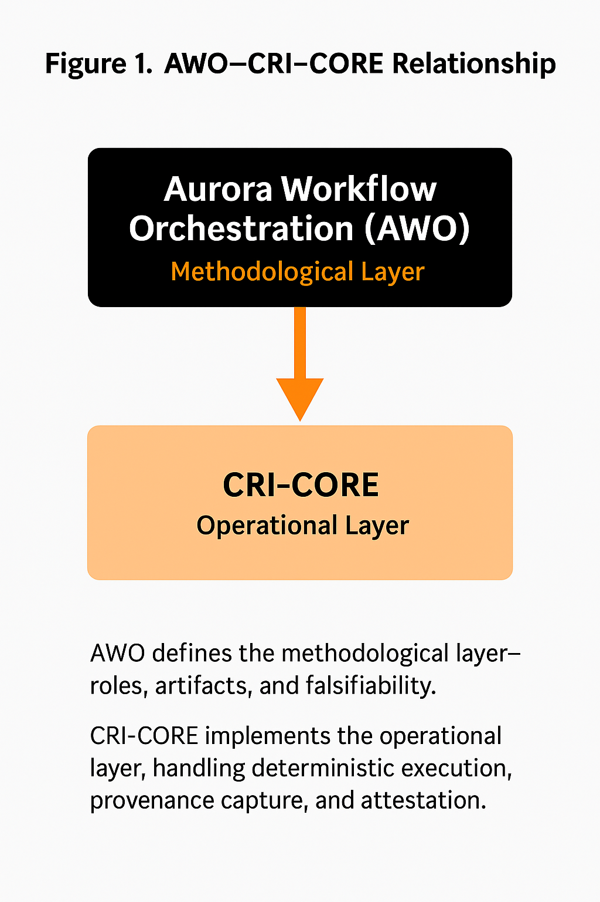

# Aurora Workflow Orchestration (AWO) — Method Specification v1.2 (Final)

---
title: Aurora Workflow Orchestration (AWO)
version: 1.2.0
maintainer: Waveframe Labs
program: Aurora Research Initiative
license: CC BY 4.0 (text), Apache 2.0 (code)
doi: 10.5281/zenodo.TBD
date: 2025-10-19
---

## Abstract
Aurora Workflow Orchestration (AWO) defines a structured, audit-first methodology for AI-assisted research.
It establishes deterministic roles, reproducible artifacts, and falsifiability gates to ensure transparent scientific progress.
This release (v1.2.0) finalizes automation for documentation builds and institutional alignment **within Waveframe Labs’ Aurora Research Initiative**,
establishing the foundation for **CRI-CORE**, the runtime layer that operationalizes continuous research verification.

**Keywords:** reproducible research, AI orchestration, falsifiability, provenance, audit automation

---

**Author:**  
Shawn C. Wright

**Affiliation:**  
Waveframe Labs — Aurora Research Initiative (Independent Researcher)

**Version:**  
1.2  ·  **Date:** 2025-10-19  
**Status:** Final (Canonical Specification)  
**Supersedes:** AWO_Method_Spec_v1.1 (2025-10-07)

**DOI:**  
[10.5281/zenodo.17345552](https://doi.org/10.5281/zenodo.17345552)

**License:**  
CC BY 4.0 (text) · Apache-2.0 (code)

---

### Purpose
Define a **repeatable, falsifiable, and auditable** methodology for AI-assisted research and analysis such that any independent party can reproduce both the process and the evidence supporting its outcomes.

---

### Figure 1 — AWO–CRI-CORE Relationship

AWO defines the **methodological layer**—roles, artifacts, and falsifiability.  
CRI-CORE implements the **operational layer**, handling deterministic execution, provenance capture, and attestation.  
Together they form a continuous epistemic verification stack.

---

## Scope
AWO governs the structure of AI-assisted research into falsifiable claims, audited iterations, and immutable, citable releases.  
It defines the **methodological layer** that enforces reproducibility and auditability.  
**CRI-CORE** provides one possible **implementation layer** automating AWO-compliant runs and manifests, but AWO remains valid independently of it.

---

## Normative Requirements

1. **Falsifiability** — Every claim MUST define a testable procedure that could falsify it.  
2. **Full Logging** — Every reasoning step MUST be timestamped and schema-validated when applicable.  
3. **Independent Audit** — Logic, data, and peer reviews MUST be performed by separate agents or processes.  
4. **Rejection Loop** — Failed audits MUST trigger revision or withdrawal, not defense.  
5. **Portability** — Artifacts SHOULD be domain-agnostic and reusable across contexts.  
6. **Version Locking** — All claims and outputs MUST reference immutable identifiers (tags, hashes, DOIs).

---

## Roles

- **Orchestrator (Human)** — Frames questions, defines falsifiability criteria, resolves conflicts, approves releases.  
- **Main Model (Continuity)** — Maintains project context, synthesizes results, integrates audit feedback.  
- **Auxiliary Auditors (Independent)** —  
  - *Logic Auditor* — Validates reasoning consistency.  
  - *Data Validator* — Empirically tests claims.  
  - *Peer Critic* — Conducts adversarial conceptual review.  
- **System Auditor (Optional)** — Verifies runtime integrity and provenance (e.g., CRI-CORE logs).

---

## Core Artifacts

- **Falsifiability Manifest** (`/docs/FALSIFIABILITY_MANIFEST.md`) — claim IDs, tests, datasets, thresholds, status.  
- **Workflow Logs** (`/logs/*.md`) — dated entries with actions, insights, next steps, skills.  
- **Decision Records (ADRs)** (`/decisions/*.md`) — context, decision, consequences, evidence links.  
- **Evidence Registry** — actual repo folders:  
  - `/figures/` — images/plots referenced by ADRs.  
  - `/models/` — optional saved model artifacts.  
  - `/scripts/` — helper scripts used in iterations.  
  - `/workflows/` — executable workflow specs.  
  - `/schemas/` — validation and reproducibility schemas.  
- **Run Manifests** (`/runs/run_*/run_manifest.json`) — canonical runtime records.  
- **Attestation & Sums** (`/runs/run_*/ATTESTATION.txt`, `SHA256SUMS.txt`, `.sig`, `.cert`) — cryptographic proof and checksums.  
- **Release Artifacts** — `CHANGELOG.md`, `CITATION.cff`, `.zenodo.json`, Git tag, Zenodo DOIs.

> *Note:* This specification intentionally omits `/notebooks` and `/data` because they are not present in this repository.  
> If future projects require them, add explicitly and document via ADRs and Manifests.

---

## Lifecycle (One Iteration)

0. **Setup** — Define claims, initialize Manifest, assign auditors.  
1. **Draft (Main Model)** — Produce reasoning and outputs tagged with claim IDs.  
2. **Audit (Independent)** — Logic, data, peer auditors record pass/fail results.  
3. **Synthesis (Main Model)** — Reconcile audits, revise claims or methods.  
4. **Decision** — Record outcome in ADR (accepted / revised / withdrawn).  
5. **Evidence Capture** — Save figures, scripts, models; update Manifest status.  
6. **Release Gate** — Validate reproducibility, verify attestations, confirm cross-refs, tag release, archive on Zenodo.

---

## Logging Schema

- **Log Entry:** date, action, lesson, next step, skills.  
- **Audit Record:** claim ID, auditor, check type (logic | data | peer), criteria, result, evidence links.

All logs SHOULD conform to JSON schemas under `/schemas/` when available.  
Schema version SHOULD match the repository release tag (e.g., v1.2).

---

## Rejection Handling

Any failed audit → revise draft or withdraw claim.  
Partial failures → enter **conditional revision** state until all criteria pass.  
Update Manifest and ADR accordingly. No appeals without new evidence.

---

## Portability Guidelines

- Keep templates generic; avoid domain jargon.  
- Parameterize datasets and metrics in Manifest only if they exist in repo.  
- Use Model Roster to swap models or auditors without changing process.  
- Derived projects (e.g., CRI-CORE or domain forks) MUST preserve schema compatibility.

---

## Conformance Checklist

- [ ] Manifest exists with ≥1 falsifiable claim and test.  
- [ ] Logs present for each iteration (draft → audit → synthesis → decision).  
- [ ] ≥1 ADR captures a non-trivial decision or trade-off.  
- [ ] Release artifacts present; latest tag archived with Concept + Version DOIs.  
- [ ] Attestation artifacts verifiable (`ATTESTATION.txt`, `SHA256SUMS.txt`, signatures).  
- [ ] (If schemas present) Validation passed for logs and manifests.

---

## Example Reference

**Waveframe v4.0** — Canonical case study demonstrating AWO artifacts and citable release within the Aurora Research Initiative.

---

## File and Folder Conventions

- `/templates/*.md|yaml` — Reusable templates.  
- `/schemas/*.json` — Validation and reproducibility schemas.  
- `/decisions/` — Governance records.  
- `/logs/` — Execution history.  
- `/docs/` — Whitepapers, manifests, specifications.  
- `/runs/` — Runtime results and attestation.  
- `/figures/`, `/models/`, `/scripts/`, `/workflows/` — Evidence and execution assets.

---

**Maintained by Waveframe Labs**  
📧 `swright@waveframelabs.org`  
🔗 https://waveframelabs.org

**Status:** Finalized within Aurora Research Initiative · October 2025  
Future changes appear only as *Implementation Notes*, not method revisions.
